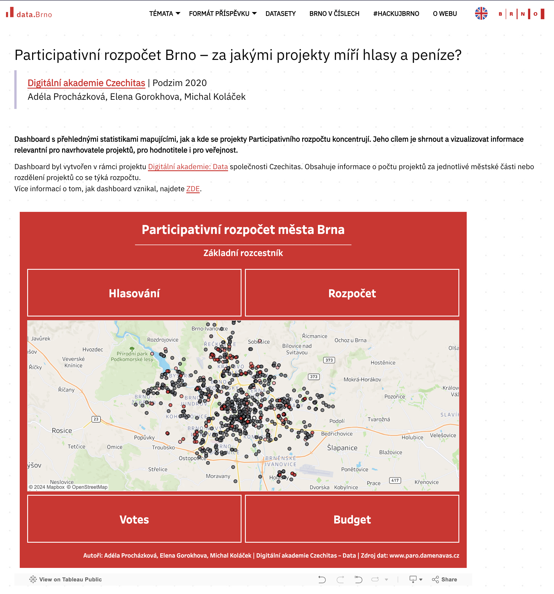

# brno-part-budget

This repository provides data for the visualisation of projects submitted
to the [Brno's participatory budget](https://damenavas.brno.cz/).

To achieve this, the script does the following daily:
- Downloads data on participatory budget projects through an API
- Scrapes data on public votes from a webpage
- Merges and cleans the data
- Pushes the resulting dataset into a Google Spreadsheet

To explore, visit the resulting interactive dashboard on
[Tableau Public](https://public.tableau.com/views/ParticipativnrozpoetmstaBrna_17177050818370/NavigationDB)
or the city's data portal [data.Brno](https://data.brno.cz/pages/a41adae354334c859561731eabe9cf40).

---

This project was initially developed as part of the Data Academy by [Czechitas](https://www.czechitas.cz/en/).

Collaborators:
- [Adéla Procházková](mailto:adelaprocha(at)gmail.com)
- [Elena Gorokhova](mailto:elena.o.gorokhova(at)gmail.com)
- [Michal Koláček](mailto:kolacek.m(at)gmail.com)
